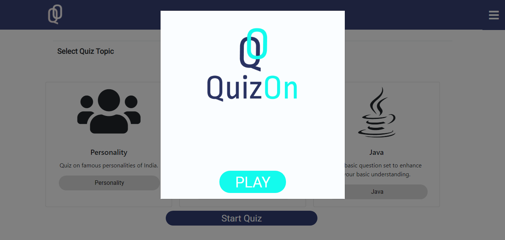
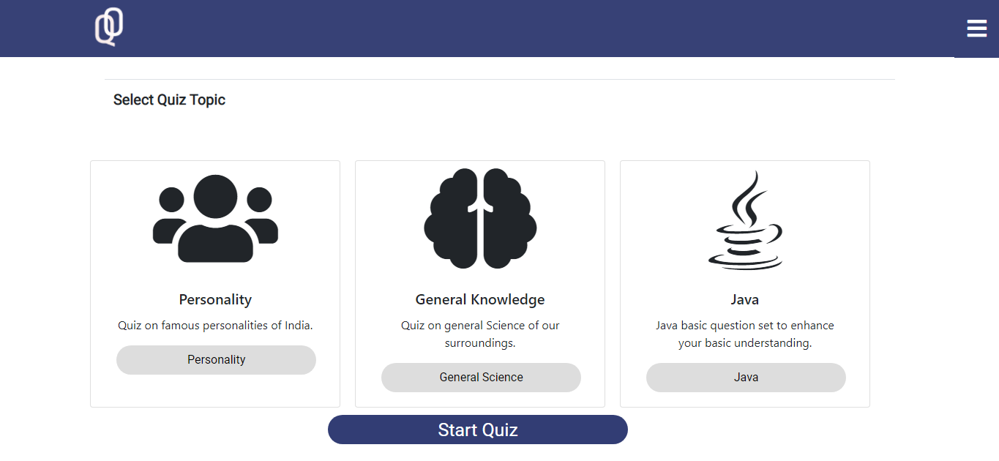
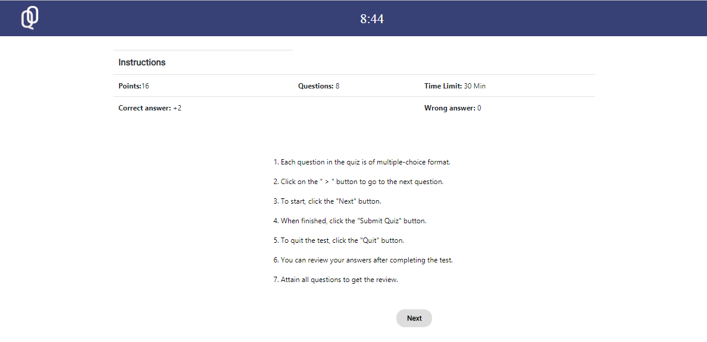
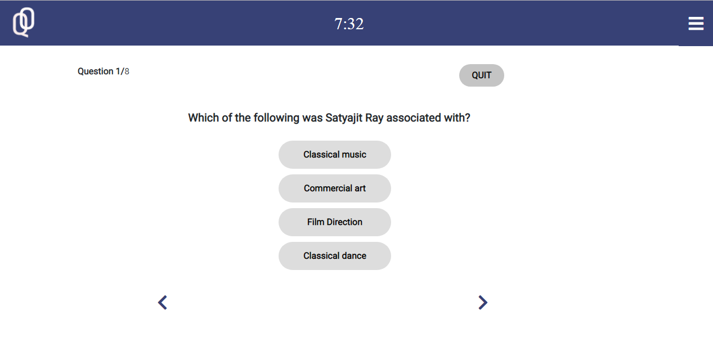
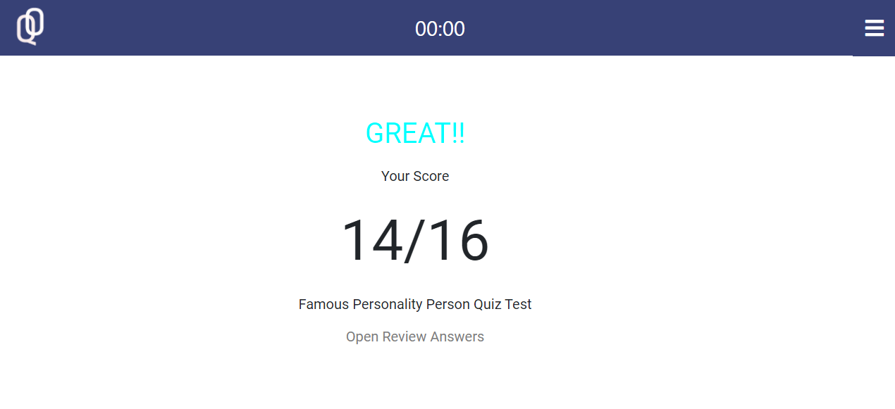
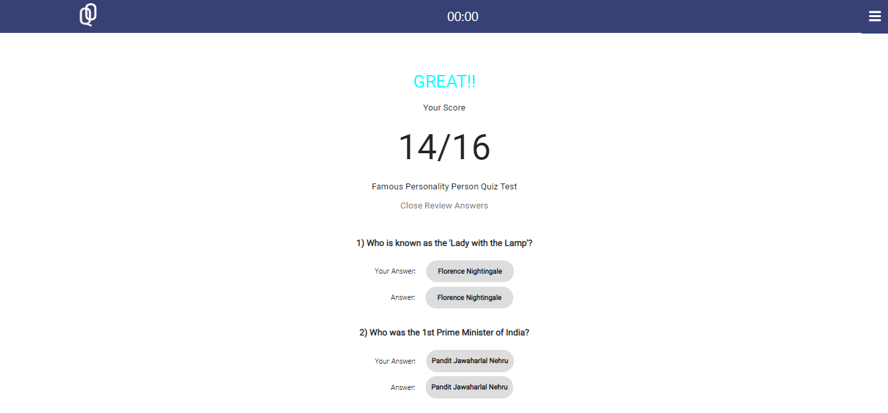

# QuizOnUsingMEN
QuizOn a quiz taking application using Mongo DB , NodeJS and Express. In this application the front end communicate with back end using REST API.

## Authors:
Debarun Mitra

## Technology used
HTML, CSS, JavaScript, JQuery, Bootstrap,JSON

## Objective
Create a quiz application

## Guidelines
1. when you open the app, popup modal will appear.
2. This modal contains Quiz application logo and start button.
3. When you click start button, you will get instructions and start attempting the quiz.
4. After taking test you will get the score.
5. At last,you can review your answers.

## Images

**********************************************************

**********************************************************

**********************************************************

**********************************************************

**********************************************************

**********************************************************
